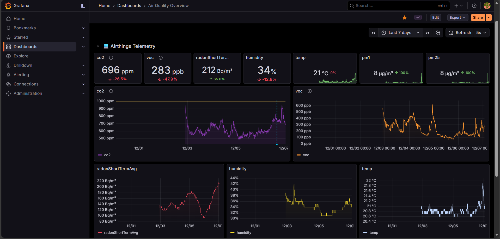

# Air Quality Dashboard

[Tested Devices](TESTED_DEVICES.md)

## 1. Create an Airthings API account
1. Visit the Airthings developer portal: https://developer.airthings.com/docs/api-getting-started-consumer
2. Follow the "Getting started" guide to create a consumer account, register an application, and obtain the following credentials:
   - `AIRTHINGS_CLIENT_ID`
   - `AIRTHINGS_CLIENT_SECRET`
3. Note the device IDs you want to monitor—they will be returned by the API once authentication works.

## 2. Configure environment variables
1. Copy `.env.template` to `.env` in the repo root.
2. Fill in every value in `.env`:
   - `AIRTHINGS_CLIENT_ID` and `AIRTHINGS_CLIENT_SECRET` from the developer portal.
   - `WEATHER_ZIP_CODE` (or any other variables you use in the worker).
3. Keep `.env` private; never commit it.

## 3. Build and start the stack
```powershell
# from the repo root
docker compose up -d --build
```
The command provisions:
- `mysql`: stores Airthings telemetry
- `grafana`: visualizes the data (binds to http://localhost:3000)
- `worker`: polls the Airthings API and writes rows to MySQL

## 4. Basic usage
1. Wait for the containers to finish initializing (`docker compose logs -f worker grafana`).
2. Open Grafana at http://localhost:3000 and log in with `admin / admin` (or your chosen password).
3. The provisioned "Air Quality Overview" dashboard should appear automatically; refresh if you edit `grafana/provisioning/dashboards/aqi_dashboard.json`.
4. To stop the stack: `docker compose down`. Add `-v` if you want to clear MySQL and Grafana volumes.

You are ready to monitor your indoor air quality with live data from the Airthings sensors.

